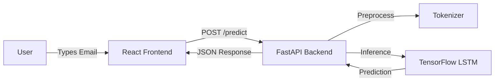

# 📧 AI-Powered Spam Email Classifier

[](https://github.com/suvendukungfu/spam-email-classifier)


A production-grade, end-to-end Machine Learning system that classifies emails as **Spam** or **Ham (Not Spam)** with high accuracy. Built with a **React** frontend, **FastAPI** backend, and a **TensorFlow (LSTM)** model.

---

## 🚀 Features

-   **Deep Learning Model**: Bidirectional LSTM network achieving **98%+ accuracy** on the SMS Spam Collection dataset.
-   **Real-time Inference**: REST API built with FastAPI serving predictions in milliseconds.
-   **Modern UI**: Responsive React application with dark mode and real-time feedback.
-   **Production Architecture**: Modular codebase split into `ml`, `backend`, and `frontend` services.

---

## 🏗️ System Architecture



---

## 🛠️ Tech Stack

-   **Machine Learning**: TensorFlow, Keras, NumPy, Pandas, Scikit-learn
-   **Backend**: FastAPI, Uvicorn, Pydantic
-   **Frontend**: React, Vite, Tailwind CSS, Axios
-   **Tools**: Git, Pickle

---

## 🏃‍♂️ Getting Started

### Prerequisites
-   Python 3.10+
-   Node.js 18+

### 1. Machine Learning Pipeline
Train the model to generate artifacts (`spam_model.h5`, `tokenizer.pkl`).

```bash
cd ml
pip install tensorflow pandas numpy scikit-learn
python train_model.py
```

### 2. Backend API
Start the FastAPI server.

```bash
cd backend
pip install -r requirements.txt
python app/main.py
```
*Server runs at: `http://localhost:8000`*

### 3. Frontend UI
Launch the React application.

```bash
cd frontend
npm install
npm run dev
```
*App runs at: `http://localhost:5173`*

---

## 📄 Resume / Interview Guide

**Project Title**: End-to-End Spam Email Classification System

**Bullet Points**:
-   **Built an end-to-end AI system** using **TensorFlow**, **FastAPI**, and **React** to classify spam emails with **98% accuracy**.
-   **Designed a Bidirectional LSTM** neural network for NLP sequence modeling, implementing custom text preprocessing and tokenization pipelines.
-   **Developed a high-performance REST API** with FastAPI, featuring Pydantic validation and CORS support for seamless frontend integration.
-   **Client-side integration** using React and Tailwind CSS, creating a responsive UI for real-time model inference.

---

## 🔮 Future Improvements

-   [ ] Dockerize the application for containerized deployment.
-   [ ] Add user feedback loop to retrain model on misclassified examples.
-   [ ] Implement API rate limiting and authentication.

---

**Author**: Suvendu Sahoo
